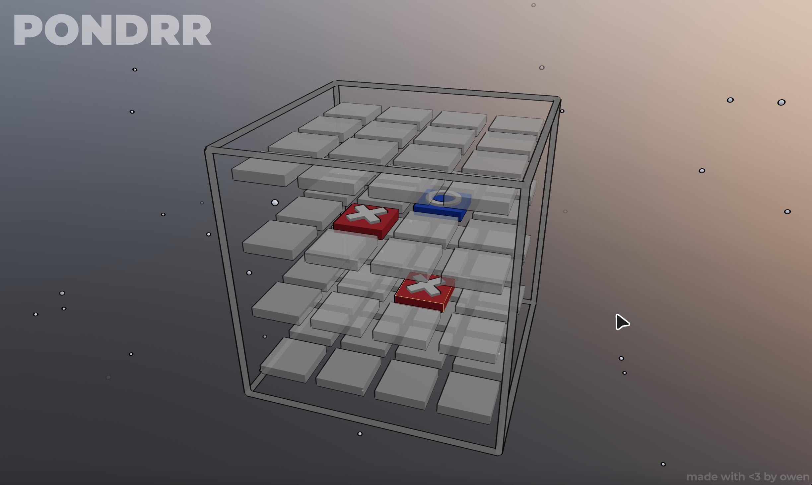
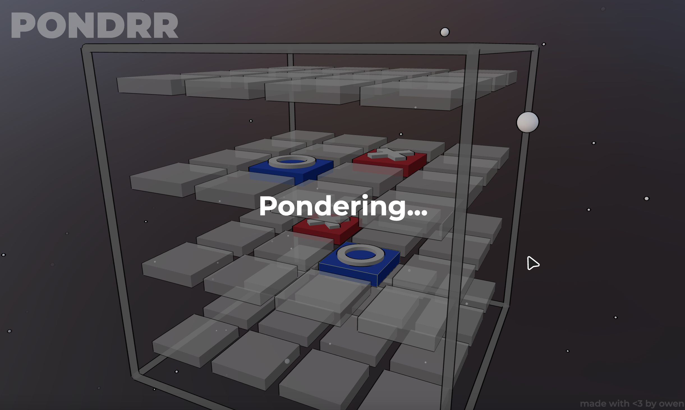
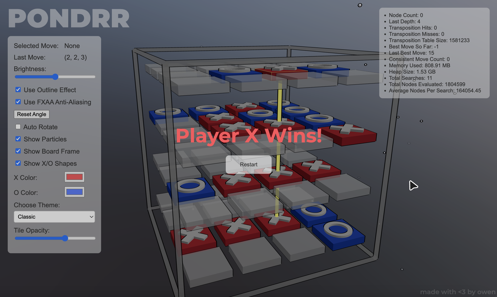
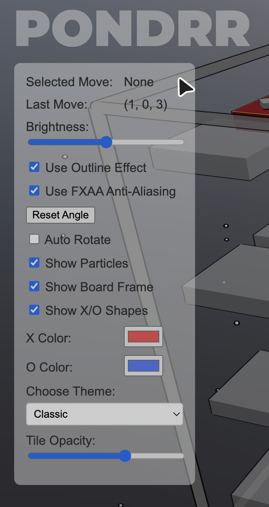
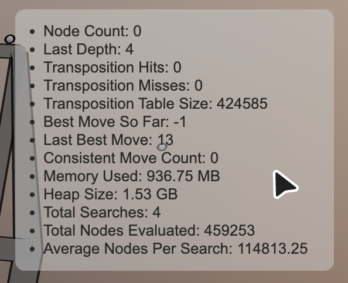

    
    <h1>pondrr</h1>
    <h3>Performant AI 3D TicTacToe player and web simulator. This was made for my AI class's 3D Tic Tac Toe competition project.</h3>

<h2>Overview</h2>

    <strong>pondrr</strong> is a real-time automated 3D 4x4 tic-tac-toe bot running in Java through HTTP protocol to a web3 frontend.

<h2>Guide</h2>
<ul>
	<li><strong>Start the server: </strong>javac *.java && java TTT3</li>
</ul>

<h2>Screenshots</h2>

  

  

  

  
